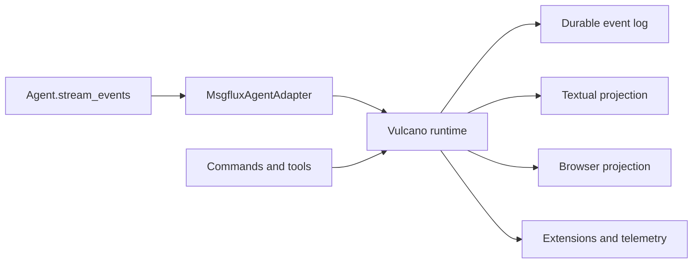

# Vulcano runtime event protocol

## Status and purpose

This document defines the event information required by Vulcano from the native
`Agent.stream_events()` API planned for msgflux. It is an integration contract,
not a requirement that the native Agent use Vulcano classes or event names.
`MsgfluxAgentAdapter` may translate native events into the stable Vulcano
`DomainEvent` protocol.

The protocol must support all of these consumers from one stream:

- the Textual terminal client;
- a future browser client;
- append-only durable session storage and replay;
- telemetry and extension observers;
- headless JSON/RPC clients;
- tests that reconstruct a run without executing the Agent again.

The runtime remains the source of truth. A client sends actions, observes facts,
and derives presentation state. Agent code, tools, slash commands, and hooks must
never call Textual widgets directly.



## Vocabulary

The distinction between an execution and an Agent turn is important. A single
user prompt may cause several model calls and tool executions before the final
answer.

| Term | Meaning |
|------|---------|
| Thread | Durable conversation identified by `ExecutionScope.thread_id`. |
| Execution | Work initiated by one submitted input. It begins with the input and ends with one terminal status. Its durable identity is `run_id`. |
| Agent turn | One assistant model message followed by all tool calls/results requested by that message. An execution may contain many turns. |
| Activity group | UI projection anchored to the user message. It contains the execution's reasoning, intermediate assistant messages, tools, diffs, artifacts, and progress. |
| Final answer | The assistant message selected by the terminal execution event. It is displayed outside the collapsible activity group. |
| Correlation | Link from a client action to every fact caused by that action. It is not a durable execution identity. |

## Required envelope information

Native Agent events do not need to instantiate `DomainEvent`, but they must
provide enough information for the adapter to populate this envelope. During a
transition, new fields may live in `payload`; the target is to promote common
identity fields to the envelope.

| Field | Required | Semantics |
|-------|----------|-----------|
| `schema_version` | Yes | Integer protocol version. Unknown additive payload fields must be ignored. |
| `type` | Yes | Stable event name. |
| `event_id` | Yes | Globally unique event identity used for deduplication. |
| `sequence` | At runtime boundary | Monotonic ordering in one thread log. Vulcano assigns it when publishing. |
| `occurred_at` | Yes | UTC timestamp. It is diagnostic data, never the ordering authority. |
| `scope` | Yes for execution events | Serialized `ExecutionScope`: `thread_id`, `namespace`, `run_id`, `parent_run_id`, and `root_run_id`. |
| `correlation_id` | Yes for action-caused events | Identifies the originating `SubmitInput`, command, cancel, or other client action. |
| `causation_id` | Recommended | `event_id` of the direct cause when known. |
| `actor` | Recommended | Producer identity such as main Agent, subagent, task, command, hook, or tool. |
| `payload` | Yes | JSON-compatible event-specific data. |

`AbortSignal`, exceptions, callables, `Path` instances, provider response
objects, and Textual/Rich objects must not cross the transport boundary. Errors
are serialized; binary or large outputs are represented by artifact references.

### Identity matrix

Every lifecycle entity needs a stable identifier. Consumers must never join
events using arrival time, adjacency, widget position, or display text.

| Identifier | Created by | Lifetime |
|------------|------------|----------|
| `thread_id` | durable runtime | conversation/session |
| `run_id` | runtime through `ExecutionScope` | one submitted execution |
| `root_run_id` | root runtime | root execution and all nested work |
| `parent_run_id` | spawning runtime | parent/child subagent or task edge |
| `correlation_id` | client action | request and its resulting facts |
| `turn_id` | Agent loop | one model/tool turn inside a run |
| `message_id` | message producer | one user, assistant, tool-result, or user-facing message |
| `part_id` | message producer | one streamed content part such as text or reasoning |
| `block_id` | block producer | one Vulcano typed block, diff, or artifact |
| `tool_call_id` | model/tool runtime | one tool request and execution |
| `task_id` | task runtime | one foreground or background task |
| `checkpoint_id` | durable runtime | one persisted execution checkpoint |

The UI's message number is derived from ordered `message.user` events. The
number is presentation state and does not need to be emitted by the Agent. The
sidebar stores `message_id` as its navigation anchor and uses `sequence` to
order items, so replay, filtering, and concurrent tool updates cannot point to
the wrong widget.

## Ordering and lifecycle invariants

These invariants apply to messages, blocks, tools, tasks, turns, and executions:

1. A `started` event precedes every update and terminal event for that id.
2. Updates are ordered for the entity. If concurrent producers exist, each
   update also carries an entity-local `update_sequence`.
3. Exactly one terminal state is produced: `completed`, `failed`, `cancelled`,
   or `aborted`.
4. A terminal event contains the canonical final snapshot. A consumer can
   reconcile it even when one or more deltas were lost or coalesced.
5. Parent entities terminate after their active children have terminated.
6. `execution.completed` is the last event belonging to a run and identifies
   the final assistant message, if one exists.
7. Replaying a persisted stream produces the same visible transcript without a
   provider call or tool execution.

`cancelled` means an acknowledged cancellation request. `aborted` means the
runtime found unfinished work after interruption, crash, disconnect, or replay.
`failed` carries a structured error. All terminal events should also expose a
common `status` value so generic clients do not need event-name-specific logic.

Delta events are append operations unless an explicit `operation` says
otherwise. `updated` events are partial snapshots or replacements and must name
their operation. Terminal snapshots are authoritative.

## Required signals for the next msgflux release

This is the minimum native stream needed to replace the current compatibility
adapter without losing UI behavior.

### Execution lifecycle

| Signal | Required payload |
|--------|------------------|
| `execution.started` | `scope`, input `message_id`, input mode, Agent identity, optional model identity |
| `execution.completed` | `scope`, `status`, `final_message_id`, duration, aggregate usage, tool count, changed-file summary |
| `execution.cancel_requested` | reason and target `run_id` |
| `execution.cancelled` | reason and ids of cancelled children |
| `execution.failed` | serialized error and failed phase |

Vulcano may keep `execution.cancelled` and `runtime.error` for compatibility,
but every path must still produce the terminal execution snapshot. An execution
that returns no assistant answer sets `final_message_id` to `null`.

### Agent-turn lifecycle

| Signal | Required payload |
|--------|------------------|
| `turn.started` | `turn_id`, `run_id`, zero-based `turn_index`, model/provider identity |
| `turn.completed` | `turn_id`, `status`, assistant `message_id`, ordered `tool_call_ids`, stop reason, usage |

A turn is not the UI activity group. All turns sharing a `run_id` belong to the
same activity group. This matches a Pi-style loop while preserving msgflux's
durable execution lineage.

### Message lifecycle

The native stream should use a role-neutral message lifecycle. It covers user,
assistant, tool-result, and custom runtime messages.

| Signal | Required payload |
|--------|------------------|
| `message.started` | `message_id`, `run_id`, optional `turn_id`, `role`, initial content parts |
| `message.delta` | `message_id`, `part_id`, part `kind`, `delta`, `operation`, `update_sequence` |
| `message.completed` | `message_id`, complete canonical content parts, `status`, stop reason, error, usage |

Content part kinds should at least include `text`, `reasoning`, `tool_call`,
`image`, and `artifact_ref`. Tool-call argument streaming must identify the
`tool_call_id` and carry either argument deltas or the current parsed snapshot.

The adapter projects the role-neutral stream onto the current Vulcano events:

| Native information | Vulcano projection |
|--------------------|--------------------|
| submitted user message | `message.user` |
| assistant text lifecycle | `assistant.started`, `assistant.delta`, `assistant.completed` |
| reasoning part | `assistant.block.*` with `kind="reasoning"` |
| tool-call part and execution | `tool.started`, `tool.updated`, `tool.completed` |
| custom display part | typed block or `message.custom.<type>` |

Every projected lifecycle payload must include its `message_id` and `turn_id`.
The current event names remain stable; adding ids is backward-compatible for
clients that ignore unknown fields.

The final message cannot always be known when its first token arrives. The UI
therefore streams all assistant messages inside the expanded activity group.
When `execution.completed.final_message_id` arrives, it moves that message
outside the group without recreating its content. All other assistant messages
remain inside the collapsible group.

### Tool lifecycle

Tool signals cover both model-requested tools and tools invoked by commands or
custom Agent flows.

| Signal | Required payload |
|--------|------------------|
| `tool.requested` | `tool_call_id`, name, raw/partial arguments, source `message_id` |
| `tool.started` | `tool_call_id`, name, validated arguments, `turn_id`, execution mode |
| `tool.updated` | `tool_call_id`, progress/result delta, optional percentage and status text, `update_sequence` |
| `tool.completed` | `tool_call_id`, name, canonical result, structured details, `is_error`, `status`, duration |

Useful optional tool fields are `started_at`, `ended_at`, `stdout`, `stderr`,
`mime_type`, `added_tool_names`, `terminate`, retry attempt, and the ids of
created artifacts or diffs. Large output must use an artifact reference instead
of making every event carry the entire value.

Tool arguments and results may contain secrets. Producers should mark sensitive
fields or provide a redacted display value. Persistence and telemetry must use
the redacted representation unless explicitly configured otherwise.

### Intermediate user-facing messages

`send_user_message` is a normal Agent tool and therefore produces the standard
tool lifecycle. In addition, it publishes a dedicated display fact:

| Signal | Required payload |
|--------|------------------|
| `assistant.user_message` | `message_id`, Markdown `content`, `run_id`, optional `turn_id` and `tool_call_id`, severity, optional title |

This message is visible immediately but is never considered the final answer.
It stays inside the activity group and is persisted/replayed. The tool accesses
an execution-scoped event emitter through a `ContextVar`; it must not know which
client is connected and must not import Vulcano or Textual UI objects.

The emitter should be a small msgflux runtime protocol, for example an
`emit_event()` capability in the active execution context. Vulcano binds that
capability before calling the Agent. Headless Agent use may bind a recorder or
no-op implementation.

### Reasoning and typed blocks

Reasoning and non-message output use the existing block lifecycle:

| Signal | Required payload |
|--------|------------------|
| `assistant.block.started` | `block_id`, `kind`, `run_id`, optional `turn_id`, title, initial content, details |
| `assistant.block.delta` | `block_id`, delta, operation, `update_sequence` |
| `assistant.block.completed` | `block_id`, `kind`, canonical content, details, terminal status |

Built-in kinds are `text`, `reasoning`, `tool`, `diff`, `artifact`, and `error`.
Reasoning is collapsed by default and may be omitted or redacted by a provider.
Clients must not assume reasoning is always available.

### Diffs and workspace changes

Diffs should use `kind="diff"` blocks so the same stream works for the Rich
renderer, browser UI, export, and replay. `details` should carry structured
metadata rather than forcing consumers to parse the patch:

| Field | Meaning |
|-------|---------|
| `path` | current workspace-relative path |
| `old_path` | previous path for rename/delete operations |
| `operation` | `add`, `modify`, `delete`, `rename`, `chmod`, or `binary` |
| `state` | `proposed`, `applying`, `applied`, `reverted`, or `failed` |
| `format` | normally `unified` |
| `additions` / `deletions` | line statistics when meaningful |
| `before_hash` / `after_hash` | optional content identity used for reconciliation |
| `tool_call_id` | tool execution that caused the change |
| `artifact_id` | reference when a patch is too large to inline |

The block content contains the unified patch and may stream in deltas. The
terminal event contains the complete patch or an artifact reference. A binary
change carries metadata and an artifact reference, not binary bytes.

One tool call may create several diff blocks. `execution.completed` includes an
ordered changed-file summary so a navbar `Changes` view does not need to scan
arbitrary tool result strings. A workspace watcher may also publish
`workspace.changed` for changes that cannot be attributed to a tool, but this
does not replace the diff lifecycle.

## Signals needed for full Vulcano behavior

These signals may be implemented after the minimum native Agent stream. Their
payloads and identities should be reserved now so extensions do not invent
incompatible custom protocols.

### Input queue and steering

The authoritative queue signal should contain the full queue snapshot:

| Signal | Payload |
|--------|---------|
| `input.queue.changed` | ordered `steering` and `follow_up` items with correlation id, content, mode, and position |
| `input.dequeued` | selected item, mode, and remaining count |
| `input.queue.cleared` | reason and removed items |

Vulcano currently publishes `input.queued`, `input.dequeued`, and
`input.queue.cleared`. It can derive the snapshot while keeping those events for
compatibility. A full snapshot prevents a dropped delta from leaving the client
with an incorrect queue.

### Plans, progress, and tasks

| Signal | Payload |
|--------|---------|
| `plan.updated` | stable step ids, text, status, ordering, optional explanation |
| `task.started` | `task_id`, name, kind, parent run/task, foreground/background mode |
| `task.updated` | `task_id`, status text, progress, metrics, `update_sequence` |
| `task.completed` | `task_id`, terminal status, result/artifact refs, duration |
| `task.log` | `task_id`, stream (`stdout`, `stderr`, or `log`), text delta |

Background tasks must inherit `thread_id` and `root_run_id`, create their own
`run_id`, and set `parent_run_id`. A task may outlive the foreground execution;
its events remain attached to its own run and can appear in a Tasks view instead
of being incorrectly appended to a completed activity group.

### Subagents

Subagents reuse execution, turn, message, tool, and task signals. They do not
need a parallel event vocabulary. Their `actor` identifies the subagent and
their `ExecutionScope` establishes lineage. The following metadata is useful:

- stable Agent id and display name;
- parent Agent/run id;
- delegated objective;
- synchronous or background mode;
- child result summary and artifact references.

This lets the UI render a subagent tree while telemetry and durable execution
use the same causal graph.

### Durable execution and checkpoints

| Signal | Payload |
|--------|---------|
| `execution.suspended` | `run_id`, reason, checkpoint id, resumability |
| `execution.resumed` | `run_id`, checkpoint id, resume attempt |
| `checkpoint.saved` | checkpoint id, run id, store identity, logical position |
| `checkpoint.restored` | checkpoint id, run id, restored position |
| `execution.waiting` | reason such as approval, user input, dependency, or scheduled wakeup |

Checkpoint payloads contain references and metadata, never the complete private
checkpoint state. Resume must preserve `run_id` when continuing the same
logical execution and create a child run when the durable runtime starts a new
attempt. The distinction must be explicit in `ExecutionScope`.

### Approval and user input

Vulcano currently implements this family as `permission.requested` and
`permission.resolved`, answered by `ResolvePermission`. The native Agent stream
may use the more general approval names below; the adapter must preserve the
request id, choices, execution scope, and related tool identity.

| Signal | Payload |
|--------|---------|
| `approval.requested` | request id, prompt, choices/policy, related tool call, timeout |
| `approval.resolved` | request id, decision, resolver, optional reason |
| `user_input.requested` | request id, prompt/schema, related run/tool, timeout |
| `user_input.resolved` | request id, status and redacted response |

These are runtime facts. The TUI may answer with actions, but an Agent or tool
must not open a Textual modal directly.

### Context management, retry, and limits

| Signal | Payload |
|--------|---------|
| `context.compaction.started` | reason, estimated tokens, attempt |
| `context.compaction.completed` | status, before/after token estimates, summary message id, retry flag |
| `retry.started` | scope/phase, attempt, maximum attempts, delay, serialized cause |
| `retry.completed` | attempt, success, terminal error when present |
| `usage.updated` | input/output/cache/reasoning tokens and optional cost snapshot |
| `limit.updated` | context, rate, time, or budget limit and remaining value |

Usage events are cumulative snapshots within a turn or execution. This avoids
double counting during replay and provider-specific delta behavior.

### Sessions, runtime, configuration, and extensions

The existing Vulcano signals remain part of the runtime protocol:

- `runtime.started`, `runtime.stopped`, and `runtime.error`;
- `session.switched`, `session.tabs.updated`, plus future `session.forked` and
  replay boundaries;
- `command.started`, `command.output`, `command.completed`, and `command.error`;
- `extension.loaded`, `extension.unloaded`, and `extension.failed`;
- `client.action` for runtime-authorized presentation effects.

`runtime.started` should advertise a protocol version and capability names.
Examples include `native_agent_events`, `reasoning`, `tool_progress`, `diffs`,
`durable_execution`, `background_tasks`, `approvals`, and `usage`. Clients then
degrade deliberately instead of inferring support from missing events.

Configuration changes that affect future work should publish typed facts such
as `model.changed`, `thinking.changed`, `tools.changed`, and `skills.changed`.
Their payload contains the new public snapshot and the source of the change.

`session.tabs.updated` is a runtime workspace snapshot rather than an Agent
signal. It contains one entry per open `thread_id`, pin state, lifecycle status,
the active thread, and the configured `max_tabs` capacity. Clients answer with
activate, pin, and close actions; only `session.switched` carries replay data.

## Activity group and sidebar projection

The Textual UI can derive the proposed compact transcript entirely from the
event stream:

```text
User message #4                                      running
└─ Activity: 3 tools · 2 files · 12.4 s             [collapse]
   ├─ reasoning
   ├─ tool call/result
   ├─ diff
   └─ send_user_message

Assistant final answer
```

Projection rules:

1. `message.user` creates the transcript anchor and sidebar entry.
2. `execution.started` creates one expanded activity group keyed by `run_id`.
3. Turns, non-final assistant messages, reasoning, tools, diffs, artifacts,
   task progress, and `assistant.user_message` route to that group by `run_id`.
4. `execution.completed.final_message_id` moves the selected message after the
   group and marks it as the final answer.
5. A successful group auto-collapses. Failed, cancelled, or aborted groups stay
   expanded. User choice overrides the default.
6. The group header summary is derived from terminal tool, diff, usage, and
   execution events.
7. Clicking sidebar item `N` scrolls to the widget anchored by the corresponding
   user `message_id`. The current item is derived from viewport intersection,
   not emitted by the runtime.

The sidebar should show a short user-message excerpt, derived ordinal, terminal
status, and optional changed-file/tool counts. It may be rebuilt after session
replay because no navigation-only state is required in the durable log.

## Replay, reconnect, and persistence

The event log is append-only. A reconnecting client receives a snapshot plus a
cursor or replays from the last acknowledged sequence. At-least-once delivery
is acceptable when `event_id` is stable and consumers deduplicate it.

Replay rules:

- terminal snapshots reconcile accumulated deltas;
- unknown event types and additive fields are ignored;
- unfinished entities synthesize terminal `aborted` events during recovery;
- replayed events retain original ids, scope, sequence, and timestamps;
- a fork retains source event identities and starts new events with the forked
  thread identity and a monotonic sequence for that log;
- presentation-only hover, focus, scroll, and collapse state are not persisted;
- explicit user choices that affect runtime behavior are persisted as actions
  and resulting domain facts.

For very long sessions, the runtime may publish a materialized transcript
snapshot and continue with events after its cursor. The snapshot must use the
same ids and canonical entity shapes as terminal events.

## Backpressure and performance

Producers must never drop lifecycle boundaries, terminal snapshots, errors,
cancellation, approvals, or queue snapshots. High-frequency text, reasoning,
progress, and log deltas may be coalesced while preserving order and final
content.

The UI currently renders Markdown at no more than 30 frames per second. That is
a presentation limit, not a provider-stream limit. Persistence may batch disk
writes, but acknowledged durable events must survive process interruption.

Large tool results, logs, images, and patches use artifact references. Event
payloads should remain small enough for JSONL, RPC, and browser transports.

## Error schema

Every failed terminal event should expose a JSON-compatible error object:

```json
{
  "type": "ToolExecutionError",
  "message": "Command exited with status 1",
  "code": "tool_exit_nonzero",
  "retryable": false,
  "phase": "tool.execute",
  "details": {},
  "traceback": null
}
```

Tracebacks are optional and disabled or redacted in normal client streams.
`runtime.error` is reserved for a diagnostic not already represented by a
failed entity or for a failure that escapes its normal lifecycle.

## Extension rules

Extensions may observe all events and register custom events. Custom names use a
namespaced form and JSON-compatible payloads. They should reuse standard ids and
scope whenever they participate in an execution.

Custom renderers are presentation adapters only. A persisted custom event must
still have a meaningful fallback representation such as Markdown text, status,
or an artifact reference. Reloading an extension must not make its old session
events undecodable.

Hooks may inspect or control execution through msgflux hook APIs, then publish
facts through the active runtime emitter. Passive event observers fail open and
cannot mutate, delay, or replace the stream.

## Initial implementation checklist

The native streaming release is sufficient for Vulcano when all items below are
true:

- [ ] Every event carries a complete `ExecutionScope` or inherits it through a
      documented stream boundary.
- [ ] Runs, turns, messages, parts, and tool calls have stable ids.
- [ ] The stream includes execution, turn, role-neutral message, and tool
      lifecycle boundaries.
- [ ] Terminal events contain canonical snapshots and one common status.
- [ ] `execution.completed` identifies the final assistant message.
- [ ] Tool progress and structured details can represent diffs and artifacts.
- [ ] Cancellation closes all open lifecycles.
- [ ] Nested/subagent work propagates `parent_run_id` and `root_run_id`.
- [ ] Events and payloads serialize to JSON without framework objects.
- [ ] A replay test reconstructs an identical transcript and aborts interrupted
      entities deterministically.
- [ ] A compatibility test maps native events to the existing Vulcano
      `DomainEvent` names.
- [ ] Capability negotiation reports which optional signal families are active.

## Migration from the compatibility adapter

Today `MsgfluxAgentAdapter` synthesizes
`assistant.started`/`delta`/`completed` around `Agent.acall()` and
`ModelStreamResponse`. This preserves Markdown streaming but cannot expose the
full Agent loop, tool progress, nested turns, or authoritative final-message
identity.

When native `Agent.stream_events()` lands:

1. keep `ExtensionApi.agent.stream_events()` as the stable high-level entry
   point;
2. translate native events only in `MsgfluxAgentAdapter`;
3. add ids and scope to existing Vulcano event payloads;
4. add execution and turn boundaries before implementing grouped transcript
   widgets;
5. retain the compatibility path for a non-streaming custom Agent only if the
   public msgflux Agent contract still allows it;
6. validate native and replay streams against the same projection tests.

The Textual client, extensions, session store, and future browser client should
not need to understand provider-specific response classes after this migration.
