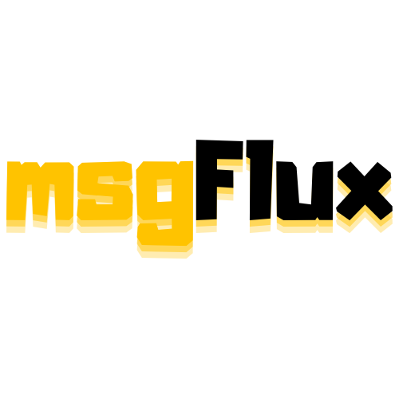

# msgFlux { .homepage-title }

<div class="hero-split">
<div class="hero-left">

</div>
<div class="hero-right">
<p class="tagline"><em>Dynamic</em> AI Systems</p>
<div class="tabbed-set tabbed-alternate" data-tabs="0:2">
<input checked="checked" id="__tabbed_0_1" name="__tabbed_0" type="radio" />
<input id="__tabbed_0_2" name="__tabbed_0" type="radio" />
<div class="tabbed-labels">
<label for="__tabbed_0_1">uv</label>
<label for="__tabbed_0_2">pip</label>
</div>
<div class="tabbed-content">
<div class="tabbed-block">
<div class="highlight"><pre><code>uv add msgflux</code></pre></div>
</div>
<div class="tabbed-block">
<div class="highlight"><pre><code>pip install msgflux</code></pre></div>
</div>
</div>
</div>
</div>
</div>

msgFlux is an open-source framework for building dynamic AI systems using **composable modules**. At a high level, msgFlux defines a clear and flexible way to structure AI systems without enforcing a single mental model. Instead of coupling architecture, data flow, and prompts into one rigid pattern, the framework separates concerns while allowing them to work together naturally.

## **AI Systems *not* ML Systems**

**ML systems** are systems *for* AI — training, evaluating, and deploying models. **AI systems** are systems *with* AI — software where pretrained models are components within a larger application. The model is not the product; it is a building block. You are not training a model — you are *programming with one*. This is the space msgFlux occupies.

## **Declarative and Imperative**

One of the core ideas in msgFlux is that **interaction style is a module-level decision**. Each module can operate in one of two complementary modes:

- **Imperative**: the module receives inputs explicitly and returns outputs directly.

- **Declarative**: the module declares where it reads data from and where it writes results inside a shared message object.

=== "Imperative"

    The agent receives input directly and returns output explicitly:

    ```python linenums="1"
    import msgflux as mf
    import msgflux.nn as nn

    model = mf.Model.chat_completion("openai/gpt-4.1-mini")

    class Summarizer(nn.Agent):
        model = model
        instructions = "Summarize the given text in one sentence."

    agent = Summarizer()

    result = agent("Transformers use self-attention...")  # (1)!
    print(result)  # (2)!

    ```

    1. Input is passed **directly** as an argument — like calling any Python function.
    2. Output is **returned explicitly** — the caller receives the result immediately.

=== "Declarative"

    The agent reads from `msg.article` and writes to `msg.summary` — no manual wiring between steps:

    ```python linenums="1" hl_lines="9 10"
    import msgflux as mf
    import msgflux.nn as nn

    model = mf.Model.chat_completion("openai/gpt-4.1-mini")

    class Summarizer(nn.Agent):
        model = model
        instructions = "Summarize the given text in one sentence."
        message_fields = {"task_inputs": "article"}  # (1)!
        response_mode  = "summary"  # (2)!

    agent = Summarizer()

    msg = mf.Message()
    msg.article = "Transformers use self-attention..."  # (3)!
    agent(msg)

    print(msg.summary)  # (4)!

    ```

    1. **Reads from** `msg.article` — the agent knows *which field* contains its input.
    2. **Writes to** `msg.summary` — the result is placed back on the shared message.
    3. The caller writes data to the message — the agent never sees the field name directly.
    4. After execution, the result is available on the message — no return value needed.

In the imperative model, a module behaves like a regular Python callable. Inputs are passed directly, execution is explicit, and outputs are immediately returned. This is ideal for simple pipelines, scripts, or cases where control flow is clear and localized.

In the declarative model, a module is configured with knowledge about the structure of the message it operates on. Instead of receiving arguments, it knows *which fields to read* and *which fields to populate*. This enables complex workflows where data flows through multiple modules without manual wiring, making composition and orchestration significantly easier.

## **Prompting and Programming**

On top of this interaction model, msgFlux deliberately distinguishes between **programming** and **prompting**, treating them as complementary but separate responsibilities.

- **Prompting** is where you define behavior *expressively*. Instead of embedding logic into code, you describe intent, instructions, roles, and constraints directly in natural language. These prompts are written explicitly and intentionally, but remain scoped by the signatures and modules that contain them.

- **Programming** is where you define the system structurally. This includes defining modules, agents, and especially **[signatures](https://dspy.ai/learn/programming/signatures/)**: typed, explicit contracts that describe inputs and outputs. Signatures formalize the behavior of a component and allow reasoning, validation, and optimization at the code level.

=== "Programming"

    Define behavior through a **signature** — a typed contract that specifies inputs and outputs. msgFlux generates the prompt and parses the structured result:

    ```python linenums="1"
    from typing import Literal

    class ClassifySentiment(mf.Signature):
        """Classify the sentiment of a sentence."""  # (1)!

        sentence: str = mf.InputField(desc="Text to analyze")
        sentiment: Literal["positive", "negative", "neutral"] = mf.OutputField()
        confidence: float = mf.OutputField(desc="Score between 0 and 1")

    class Classifier(nn.Agent):
        model = model
        signature = ClassifySentiment

    classifier = Classifier()
    result = classifier("I loved the movie, but the ending was disappointing.")
    # {'sentiment': 'neutral', 'confidence': 0.75}
    ```

    1. The docstring of a `Signature` becomes the agent's **instructions** — it tells the agent *what to do*.

=== "Prompting"

    Define behavior through **natural language** — system message, instructions, and expected output. You control exactly what the model sees:

    ```python linenums="1"
    class Classifier(nn.Agent):
        """Expert sentiment analyst."""

        model = model
        system_message = "You are a sentiment analysis expert."
        instructions = (
            "Analyze the sentiment of the given text. "
            "Consider nuance — a review can be mostly positive with negative aspects."
        )
        expected_output = "A JSON with 'sentiment' (positive/negative/neutral) and 'confidence' (0-1)."

    classifier = Classifier()
    result = classifier("I loved the movie, but the ending was disappointing.")
    ```

In this model, prompts are not loose strings passed around arbitrarily. They are written artifacts that live inside well-defined modules, constrained by signatures and executed within a programmed architecture.

By combining imperative and declarative modules with a clear separation between programming (signatures and structure) and prompting (written intent), msgFlux bridges classic software engineering and modern LLM-based development. The result is a system that scales from simple experiments to complex, production-ready AI applications while remaining explicit, composable, and maintainable.

*tl;dr* Think of msgFlux as **PyTorch for AI systems** — modular, composable, and built for the real world.

## Get Started

{!init_chat_completion_model.md!}


---

### **Agents**

msgFlux supports multiple styles for defining what an agent does. You can write explicit prompts for full control, use **signatures** to declare typed inputs and outputs, bind to fields on a shared **message** for pipeline composition, or give agents access to **tools** and **vars** that flow through the system. You can even use one agent as a **tool** for another. These styles compose freely — pick the right one for each component.

!!! info "Build agents for any task"

    Try the examples below after configuring your model above. Each tab demonstrates a different style or capability.

    === "Prompting"

        Write your own system message and instructions for full control:

        ```python linenums="1"
        import msgflux as mf
        import msgflux.nn as nn

        class Writer(nn.Agent):
            model = mf.Model.chat_completion("openai/gpt-4.1-mini")
            system_message = "You are an expert technical writer."
            instructions = "Write a clear, concise summary of the given topic."
            expected_output = "A 2-3 paragraph summary in markdown format."

        writer = Writer()
        writer("Explain how transformers work")
        ```

    === "Signature"

        Use `signature` to define inputs and outputs — msgFlux generates the prompt and parses structured output:

        ```python linenums="1"
        import msgflux as mf
        import msgflux.nn as nn

        class Extractor(nn.Agent):
            model = mf.Model.chat_completion("openai/gpt-4.1-mini")
            signature = "text -> summary: str, topics: list[str], sentiment: str"

        extractor = Extractor()
        result = extractor("The new iPhone has an amazing camera but the battery life is disappointing.")
        ```

        **Possible Output:**
        ```text
        {'summary': '...', 'topics': ['iPhone', 'camera', 'battery'], 'sentiment': 'mixed'}
        ```


    === "ReAct"

        Agents that reason step-by-step and use tools to find answers. `WebFetch` is a built-in tool that fetches web pages as Markdown:

        ```python linenums="1"
        import msgflux as mf
        import msgflux.nn as nn
        from msgflux.generation.reasoning import ReAct
        from msgflux.tools.builtin import WebFetch

        class ResearchAgent(nn.Agent):
            model = mf.Model.chat_completion("openai/gpt-4.1-mini")
            generation_schema = ReAct
            tools = [WebFetch]

        agent = ResearchAgent()
        agent("What is the mass of the Earth divided by the mass of the Moon?")
        ```

        The agent iterates: **think** → **act** (call tools) → **observe** → repeat until `final_answer`.

    === "Vars"

        `vars` inject runtime context into the agent's Jinja2 **templates** and into tools via `inject_vars`. The model never sees injected vars directly — they flow through the system behind the scenes.

        ```python linenums="1"
        import msgflux as mf
        import msgflux.nn as nn

        @mf.tool_config(inject_vars=["customer_id"])
        def get_balance(customer_id: str) -> str:
            """Look up the customer's current balance."""
            return db.query(customer_id)

        class BankAgent(nn.Agent):
            model = mf.Model.chat_completion("openai/gpt-4.1-mini")
            instructions = "You are helping customer {{customer_name}}."
            tools = [get_balance]

        agent = BankAgent()
        agent("What's my balance?", vars={"customer_name": "Alice", "customer_id": "C-1234"})
        ```

        `customer_name` renders into the instructions template. `customer_id` is injected directly into `get_balance` — invisible to the model, but available to the tool.

    === "Agent-as-a-Tool"

        An agent can serve as a tool for another agent. Decorate with `@tool_config` and pass the **class** to `tools`:

        ```python linenums="1"
        import msgflux as mf
        import msgflux.nn as nn

        @mf.tool_config(return_direct=True)  # (2)!
        class SentimentClassifier(nn.Agent):
            """Classify the sentiment of a given text."""  # (1)!

            model = mf.Model.chat_completion("openai/gpt-4.1-mini")
            signature = "sentence: str -> sentiment: str, confidence: float"

        class Orchestrator(nn.Agent):
            model = mf.Model.chat_completion("openai/gpt-4.1-mini")
            tools = [SentimentClassifier]

        orchestrator = Orchestrator()
        orchestrator("Classify: 'This product is terrible'")
        ```

        1. When an agent is used as a tool, the docstring becomes its **description** — this is what the parent agent sees when deciding which tool to call.
        2. `return_direct=True` means the Orchestrator returns the list of tool calls and their results directly, instead of passing them back to the model for a final response.

    === "Message-driven"

        Bind inputs and outputs to fields on a shared `Message` — the preferred approach inside pipelines:

        ```python linenums="1"
        import msgflux as mf
        import msgflux.nn as nn

        class SentimentAnalyzer(nn.Agent):
            model         = mf.Model.chat_completion("openai/gpt-4.1-mini")
            signature     = "text -> sentiment: str, confidence: float, reasoning: str"
            message_fields = {"task_inputs": "review"}
            response_mode  = "sentiment"

        analyzer = SentimentAnalyzer()

        msg = mf.Message()
        msg.review = "I loved the movie, but the ending was disappointing."
        analyzer(msg)

        print(msg.sentiment)
        print(msg.sentiment.confidence)
        ```

        The agent reads from `msg.review` and writes to `msg.sentiment` — the caller never sees internal field names. This makes modules easy to compose and reorder.

    === "Chain of Thought"

        ```python linenums="1"
        import msgflux as mf
        import msgflux.nn as nn
        from msgflux.generation.reasoning import ChainOfThought

        class MathSolver(nn.Agent):
            model = mf.Model.chat_completion("openai/gpt-4.1-mini")
            generation_schema = ChainOfThought

        solver = MathSolver()
        result = solver("Two dice are tossed. What is the probability that the sum equals two?")
        ```

        **Possible Output:**
        ```text
        {'reasoning': 'Each die has 6 faces → 36 outcomes. Only (1,1) sums to 2 → P = 1/36.', 'final_answer': '1/36 ≈ 0.0278'}
        ```


---

## **Modules** — compose AI systems like PyTorch.

msgFlux's module system mirrors `torch.nn`. Every component inherits from `nn.Module`, supports `forward()` / `aforward()` for sync and async, automatic submodule registration via `__setattr__`, parameter management, and built-in telemetry. Compose multiple modules to create a **program** — a self-contained AI system where each piece has a clear responsibility.


!!! info "Compose modules into programs"

    === "Pipeline"

        ```python linenums="1"
        import msgflux as mf
        import msgflux.nn as nn

        model = mf.Model.chat_completion("openai/gpt-4.1-mini")

        class ResearchPipeline(nn.Module):
            def __init__(self):
                super().__init__()
                self.researcher = nn.Agent(
                    name="researcher",
                    model=model,
                    instructions="Research the given topic thoroughly.",
                )
                self.writer = nn.Agent(
                    name="writer",
                    model=model,
                    instructions="Write a clear summary based on the research.",
                )

            def forward(self, topic):
                research = self.researcher(topic)
                summary = self.writer(research)
                return summary

        pipeline = ResearchPipeline()
        pipeline("How do transformers work?")
        ```

    === "Router"

        ```python linenums="1"
        import msgflux as mf
        import msgflux.nn as nn

        class Router(nn.Module):
            def __init__(self, model):
                super().__init__()
                self.classifier = nn.Agent(
                    name="classifier",
                    model=model,
                    signature="text -> intent: Literal['billing', 'technical', 'general']",
                )
                self.agents = nn.ModuleDict({
                    "billing": nn.Agent(name="billing", model=model, instructions="Handle billing queries."),
                    "technical": nn.Agent(name="technical", model=model, instructions="Handle technical support."),
                    "general": nn.Agent(name="general", model=model, instructions="Handle general queries."),
                })

            def forward(self, message):
                result = self.classifier(message)
                return self.agents[result["intent"]](message)

        router = Router(model)
        router("I need to update my payment method")
        ```

    === "Multimodal"

        Combine different modalities in a single pipeline:

        ```python linenums="1"
        import msgflux as mf
        import msgflux.nn as nn

        class MeetingAssistant(nn.Module):
            """Transcribes audio and generates structured meeting notes."""

            def __init__(self):
                super().__init__()
                self.transcriber = nn.Transcriber(
                    name="transcriber",
                    model=mf.Model.speech_to_text("openai/gpt-4o-mini-transcribe"),
                )
                self.summarizer = nn.Agent(
                    name="summarizer",
                    model=mf.Model.chat_completion("openai/gpt-4.1-mini"),
                    instructions="Generate structured meeting notes from the transcript.",
                )

            def forward(self, audio_path):
                transcript = self.transcriber(audio_path)
                return self.summarizer(transcript)
        ```

??? info "Why a PyTorch-like API?"

    Millions of developers already know PyTorch's patterns: `nn.Module`, `forward()`, submodule registration, `state_dict()`. By adopting the same conventions, msgFlux lets you **transfer your existing mental model** to AI system design.

    If you've built neural networks with PyTorch, you already know how to build AI programs with msgFlux.


---

## **Inline** — dynamic workflows that flow and adapt.

`Inline` is a lightweight DSL for declaring entire pipelines as a single expression. Sequential steps (`->`), parallel branches (`[a, b]`), conditionals (`{cond ? a, b}`), and loops (`@{cond}: a;`) — all in one readable string. Every module reads from and writes to a shared `dotdict` message. This is the *flux* — the dynamic flow that gives the library its name.


!!! info "Orchestrate agents with a single expression"

    ```python linenums="1"
    import msgflux as mf
    import msgflux.nn as nn

    model = mf.Model.chat_completion("openai/gpt-4.1-mini")


    class Router(nn.Agent):
        """Classifies user intent."""

        model = model
        signature = "text -> intent: Literal['technical', 'general']"


    class TechnicalExpert(nn.Agent):
        """Answers technical questions with precision and depth."""

        model = model
        system_message = "You are a technical expert. Be precise and detailed."


    class GeneralAssistant(nn.Agent):
        """Answers general questions in a friendly, concise way."""

        model = model
        system_message = "You are a friendly assistant. Be concise."


    router, expert, assistant = Router(), TechnicalExpert(), GeneralAssistant()


    def classify(msg):
        msg.intent = router(msg.question)

    def expert_answer(msg):
        msg.answer = expert(msg.question)

    def general_answer(msg):
        msg.answer = assistant(msg.question)


    flux = mf.Inline(
        "classify -> {intent == 'technical' ? expert_answer, general_answer}",
        {
            "classify": classify,
            "expert_answer": expert_answer,
            "general_answer": general_answer,
        },
    )

    msg = mf.dotdict(question="How does backpropagation work?")
    flux(msg)
    print(msg.answer)
    ```

    The `Router` agent classifies the intent at runtime, and `Inline` **conditionally routes** to the right expert — the pipeline adapts to the input. No `if/else` in Python, just a declarative expression.
