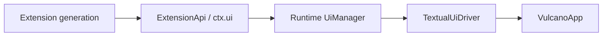

# Vulcano UI and widget gallery

## Run the gallery

Vulcano includes an extension that exercises the public UI API without a real
Agent or provider:

```bash
cd ~/projects/2fork/msgflux
source .venv/bin/activate
vulcano --mock-delay 0 -e examples/vulcano_widget_gallery.py
```

Type `/` to see the gallery commands beside the built-in runtime commands. The
gallery is an ordinary extension: it does not use private `VulcanoApp` methods
and every contribution is owned by its extension generation.

## Mock commands

| Command | UI behavior under test |
|---------|------------------------|
| `/ui-help` | Render the gallery command reference. |
| `/ui-card [text]` | Publish a typed custom message and render a Rich card. |
| `/ui-markdown` | Stream headings, a Markdown table, and a fenced code block. |
| `/ui-lifecycle [query]` | Stream reasoning, diff and artifact blocks plus a custom-rendered tool call. |
| `/ui-turn [prompt]` | Simulate a complete grouped Agent execution with tools, a diff, an intermediate user message, and a final answer. |
| `/ui-status [text\|clear]` | Set or clear an extension-owned status. |
| `/ui-widget [above\|below\|clear]` | Mount or remove a widget around the editor. |
| `/ui-notify [info\|warning\|error]` | Show each Textual notification severity. |
| `/ui-dialogs` | Run select, confirm, single-line input, and multiline editor dialogs. |
| `/ui-permission [command]` | Request runtime permission for a mock shell command. |
| `/ui-overlay` | Open a focused extension-owned Textual component. |
| `/ui-slots [show\|clear]` | Replace or restore the header and footer. |
| `/ui-working [show\|hide\|reset]` | Configure the loader used during streaming. |
| `/ui-title [text\|reset]` | Change or restore the terminal title. |
| `/ui-theme [name]` | List or activate Textual themes. |
| `/ui-reset` | Remove the gallery's persistent UI contributions. |

`Ctrl+G` tests an extension shortcut. `/ui-notify w` tests extension-provided
autocomplete. After `/ui-working show`, send a normal prompt to exercise the
custom indicator while the mock responder streams.

## Streaming Markdown

Assistant messages and slash-command output are rendered as Rich Markdown.
Headings, lists, emphasis, links, fenced code blocks, and tables therefore use
the same event projection. Run `/ui-markdown` to inspect a deterministic stream
without configuring an Agent or provider.

Vulcano keeps the accumulated source text and rebuilds its Markdown projection
after every `assistant.delta`. This is important for block structures: a table
header initially appears as incomplete text, then becomes a table as soon as
the separator row arrives. `assistant.completed` reconciles the final content
without creating another transcript message.

A real msgflux Agent currently opts into streamed model responses through its
configuration:

```python
from msgflux import nn
from msgflux.vulcano import VulcanoRuntime

agent = nn.Agent("vulcano", model, config={"stream": True})
runtime = VulcanoRuntime(agent=agent)
```

`MsgfluxAgentAdapter` consumes the resulting `ModelStreamResponse` and emits
the stable `assistant.started`, `assistant.delta`, and `assistant.completed`
lifecycle. A non-streaming Agent remains compatible, but its whole response is
projected as a single delta.

`/reload` removes the current generation and recreates the initial gallery
status and hint widget. This is useful for checking that widgets, shortcuts,
renderers, and slots do not leak across generations.

## Grouped execution simulation

Run `/ui-turn` to preview the event-driven transcript planned for the native
Agent stream. The command publishes a user message and execution boundary,
then streams reasoning, two tool calls, a `send_user_message` update, a diff,
and a Markdown final answer. No gallery code accesses a Textual widget.

The non-final activity appears in one collapsible block and leaves its final
answer visible below it. In the default `full` view, completed activity remains
expanded. The `compact` view collapses successful activity, reasoning, and tool
details while keeping failures visible. Switch modes with `/view full`,
`/view compact`, or the `--view` CLI flag. The command changes client state and
is not restored from a durable session replay.

The sidebar numbers user messages in event order; selecting an entry scrolls to
its stable message anchor. This is derived client state, so it also rebuilds
from a durable session replay.

## Permission confirmation

Run `/ui-permission` to preview a privileged operation. The runtime publishes a
`permission.requested` event and pauses the command until the client returns
`allow_once`, `allow_session`, or `deny`. Escape is a denial. Choosing the
session option remembers the exact extension-owned permission key for the
active durable thread; repeating the gallery command resolves without opening
another dialog.

The resulting `permission.resolved` event remains visible in the transcript and
is persisted for audit. Replay never restores the request, so reopening a
session cannot display an obsolete confirmation dialog.

## Default editor

The default `VulcanoTextArea` soft-wraps and grows between three and fifteen
terminal rows. It scrolls vertically after reaching the maximum.

| Key | Behavior |
|-----|----------|
| `Enter` | Submit the prompt. |
| `Shift+Enter` or `Ctrl+J` | Insert a line break. |
| `Alt+Enter` | Queue a follow-up behind all steering inputs. |
| `Alt+S` | Collapse or expand the message sidebar. |
| `Ctrl+P` | Open the searchable command palette. |
| `Up` and `Down` | Navigate the slash selector while it is open. |
| `Tab` | Complete the selected slash command. |
| `Escape` | Close a selector/modal, or cancel the active execution and pending queue. |

Extensions may replace the default editor with a Textual `Input` for
single-line behavior or a `VulcanoTextArea` subclass for multiline behavior.
The driver preserves text and reinstalls Vulcano autocomplete when necessary.

## UI ownership model



The runtime registry owns status entries, widgets, slots, renderers,
autocomplete providers, and shortcuts. The Textual driver materializes the
active state. Setup rollback, unload, and reload remove registrations in
reverse order. A stale extension context cannot mutate a newer generation.

Dialogs and immediate interactions return safe cancellation values in headless
mode. Permission requests deny by default. Persistent contributions can be
registered before a frontend binds.

## Settings convention

Vulcano uses a flat home directory and TOML configuration. The layout is
closer to Codex than Pi because Vulcano does not need Pi's extra `agent`
namespace:

| Scope | Target location |
|-------|-----------------|
| Global | `~/.vulcano/config.toml` |
| Project | `.vulcano/config.toml` |
| Global directory override | `VULCANO_HOME` |

Project configuration overrides global configuration, with nested tables
merged. TOML is treated as data; executable project extensions remain gated by
`--trust-project-extensions`. Relative global paths resolve from
`~/.vulcano`; relative project paths resolve from `.vulcano`.

Editor settings and app keybindings are grouped under `ui`:

```toml
[ui.editor]
min_height = 3
max_height = 15

[ui.transcript]
mode = "full"

[ui.keybindings]
command_palette = "ctrl+p"
toggle_sidebar = "alt+s"
cancel = "escape"
follow_up = ["alt+enter"]
newline = ["shift+enter", "ctrl+j"]
```

A project can override only the maximum:

```toml
[ui.editor]
max_height = 20
```

The loader reads global configuration first and recursively merges the project
file over it. Key values accept either one string or a list. Empty lists disable
an action; duplicate keys across built-in actions are rejected so dispatch stays
deterministic. `VULCANO_HOME` relocates configuration, extensions, and sessions.

The target user directory will also provide the natural homes for resources:

```text
~/.vulcano/
├── config.toml
├── extensions/
├── skills/
├── themes/
└── sessions/
```

Session transcripts are append-only JSONL files. Use `/sessions`, `/resume`,
`/fork`, and `/export` to exercise persistence without a real Agent.
