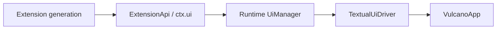

# Vulcano UI and widget gallery

## Run the gallery

Vulcano includes an extension that exercises the public UI API without a real
Agent or provider:

```bash
cd ~/projects/2fork/msgflux
source .venv/bin/activate
vulcano --mock-delay 0 -e examples/vulcano_widget_gallery.py
```

Type `/` to see the gallery commands beside the built-in runtime commands. The
gallery is an ordinary extension: it does not use private `VulcanoApp` methods
and every contribution is owned by its extension generation.

## Mock commands

| Command | UI behavior under test |
|---------|------------------------|
| `/ui-help` | Render the gallery command reference. |
| `/ui-card [text]` | Publish a typed custom message and render a Rich card. |
| `/ui-status [text\|clear]` | Set or clear an extension-owned status. |
| `/ui-widget [above\|below\|clear]` | Mount or remove a widget around the editor. |
| `/ui-notify [info\|warning\|error]` | Show each Textual notification severity. |
| `/ui-dialogs` | Run select, confirm, single-line input, and multiline editor dialogs. |
| `/ui-overlay` | Open a focused extension-owned Textual component. |
| `/ui-slots [show\|clear]` | Replace or restore the header and footer. |
| `/ui-working [show\|hide\|reset]` | Configure the loader used during streaming. |
| `/ui-title [text\|reset]` | Change or restore the terminal title. |
| `/ui-theme [name]` | List or activate Textual themes. |
| `/ui-reset` | Remove the gallery's persistent UI contributions. |

`Ctrl+G` tests an extension shortcut. `/ui-notify w` tests extension-provided
autocomplete. After `/ui-working show`, send a normal prompt to exercise the
custom indicator while the mock responder streams.

`/reload` removes the current generation and recreates the initial gallery
status and hint widget. This is useful for checking that widgets, shortcuts,
renderers, and slots do not leak across generations.

## Default editor

The default `VulcanoTextArea` soft-wraps and grows between three and fifteen
terminal rows. It scrolls vertically after reaching the maximum.

| Key | Behavior |
|-----|----------|
| `Enter` | Submit the prompt. |
| `Shift+Enter` or `Ctrl+J` | Insert a line break. |
| `Up` and `Down` | Navigate the slash selector while it is open. |
| `Tab` | Complete the selected slash command. |
| `Escape` | Close the slash selector or active modal. |

Extensions may replace the default editor with a Textual `Input` for
single-line behavior or a `VulcanoTextArea` subclass for multiline behavior.
The driver preserves text and reinstalls Vulcano autocomplete when necessary.

## UI ownership model



The runtime registry owns status entries, widgets, slots, renderers,
autocomplete providers, and shortcuts. The Textual driver materializes the
active state. Setup rollback, unload, and reload remove registrations in
reverse order. A stale extension context cannot mutate a newer generation.

Dialogs and immediate interactions return safe cancellation values in headless
mode. Persistent contributions can be registered before a frontend binds.

## Settings convention

Vulcano will use a flat home directory and TOML configuration. The layout is
closer to Codex than Pi because Vulcano does not need Pi's extra `agent`
namespace:

| Scope | Target location |
|-------|-----------------|
| Global | `~/.vulcano/config.toml` |
| Project | `.vulcano/config.toml` |
| Global directory override | `VULCANO_HOME` |

Project configuration will override global configuration, with nested tables
merged. Project-local configuration and resources must remain subject to
project trust. Relative global paths will resolve from `~/.vulcano`; relative
project paths will resolve from `.vulcano`.

The intended editor settings are grouped in a TOML table:

```toml
[ui.editor]
min_height = 3
max_height = 15
```

A project can override only the maximum:

```toml
[ui.editor]
max_height = 20
```

!!! note "Planned settings loader"
    The current preview uses the built-in values `3` and `15`. It does not read
    these TOML properties yet. The settings manager, validation, merge, trust,
    and reload behavior will be implemented as a separate runtime layer.

The target user directory will also provide the natural homes for resources:

```text
~/.vulcano/
├── config.toml
├── extensions/
├── skills/
├── themes/
└── sessions/
```

Until that migration lands, use `-e` for the gallery and the existing preview
extension discovery paths described in the main Vulcano documentation.
