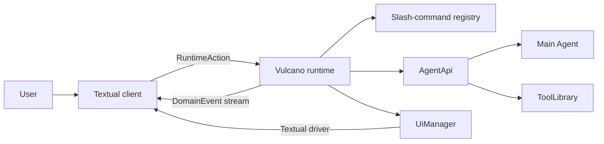

# Vulcano

## Overview

Vulcano is msgflux's terminal client for code-agent runtimes. The CLI currently
starts with a deterministic mock responder, while the runtime can already bind
the main msgflux Agent through a stable high-level facade.

The terminal is intentionally a thin client:



The runtime owns slash commands, execution state, and events. Textual only sends
actions and projects events. This boundary allows a future browser, classic
terminal, or remote client to use the same runtime without duplicating command
logic.

!!! warning "Preview CLI"
    The `vulcano` entry point still creates `MockResponder`. Application code
    can construct `VulcanoRuntime(agent=agent)` now; the CLI wiring will switch
    after the native Agent event stream is merged.

## Installation

Vulcano is included in the msgflux distribution. Its terminal dependencies are
an optional extra so importing msgflux does not load Textual or Rich:

Vulcano requires Python 3.11 or newer and uses the standard-library TOML parser.

```bash
pip install "msgflux[vulcano]"
```

Start the client with:

```bash
vulcano
```

Use `--mock-delay 0` to disable the delay between mock stream chunks.
Use `--view full` or `--view compact` to override transcript detail mode.
Use `--resume THREAD_ID` or `--fork THREAD_ID` to start from a durable session;
`--no-sessions` disables transcript persistence.

## Runtime-owned commands

Every prompt becomes a `SubmitInput` action. Inputs beginning with `/` are
parsed and executed by `CommandRegistry` inside the runtime. The client does not
keep a second command table.

The preview registers these commands:

| Command | Purpose |
|---------|---------|
| `/help` | List commands known by the runtime. |
| `/echo <text>` | Emit text from the runtime. |
| `/clear` | Request the client to clear its transcript. |
| `/view <full\|compact>` | Change transcript detail mode for the active client. |
| `/about` | Describe the active runtime. |
| `/extensions` | List loaded extensions and failures. |
| `/reload` | Unload and reload extensions. |
| `/session` | Show the active thread and persistence state. |
| `/sessions` | List durable transcript sessions. |
| `/new` | Start a new empty session in another tab. |
| `/resume <thread-id>` | Switch to and replay another session. |
| `/fork [event-sequence]` | Fork the current transcript and continue on a new thread. |
| `/export [path]` | Export the active session as Markdown. |
| `/quit` | Stop the runtime and connected clients. |

Typing `/` as the first editor character opens the runtime-backed command
selector. Continue typing to filter it, use the arrow keys to move, `Tab` or
`Enter` to complete a selection, and `Escape` to close it. Commands registered
by extensions appear without additional TUI registration.

The default editor soft-wraps long input and grows from three to fifteen terminal
rows before enabling vertical scrolling. `Enter` submits the prompt;
`Shift+Enter` or `Ctrl+J` inserts a line break. While an execution is active,
normal submissions become steering inputs. `Alt+Enter` queues a follow-up after
all steering inputs. `Escape` cancels the active execution and clears its queue.
The pending-input widget is only a projection of runtime queue events.

The default footer shows Vulcano, the active model, working directory, streaming
state, queue depth, and configured key hints. The default header is empty to
preserve vertical space; extensions may still populate its slot.

Commands that affect presentation emit a `client.action` event. The decision
still belongs to the runtime; the Textual client only applies the requested
effect.

## Extensions

An extension is a Python module with a synchronous or asynchronous `setup`
function. The function receives an `ExtensionApi` bound to that extension and
runtime generation.

Create `review.py`:

```python
from msgflux.vulcano import (
    CommandResult,
    EventDraft,
    EventType,
)

EXTENSION_NAME = "review"
EXTENSION_API_VERSION = 1


async def setup(api):
    @api.command(
        "review",
        "Review a path in the working tree.",
        usage="/review <path>",
    )
    async def review(args, ctx):
        path = args
        return CommandResult(
            events=(
                EventDraft(
                    EventType.COMMAND_OUTPUT,
                    {"text": f"Review queued for `{path}`"},
                ),
            )
        )
```

Load it explicitly:

```bash
vulcano --extension ./review.py
```

The repository also contains a runnable example:

```bash
vulcano -e examples/vulcano_extension.py
# Then enter: /hello Ada
```

The example registers a status, an editor-adjacent widget, a slash command,
and a Rich message renderer through the same extension generation.

For a complete interactive test surface, run the
[UI and widget gallery](vulcano-ui.md):

```bash
vulcano --mock-delay 0 -e examples/vulcano_widget_gallery.py
```

`-e` is the short form and may be repeated. The path can point to a `.py` file,
a Python package containing `__init__.py`, or a directory containing multiple
extensions.

The handler and `setup` may be synchronous or asynchronous. Names and aliases
are unique; collisions fail during registration. Everything registered through
`ExtensionApi` belongs to that extension generation and is removed on reload.
If `setup` fails, partial registrations are rolled back.

### Command API

Every slash-command handler receives `CommandContext.api`. Core commands get a
core `ExtensionApi`; extension commands get the API owned by their extension:

```python
@api.command("where", "Show the extension source.")
def where(args, ctx):
    source = ctx.api.source
    generation = ctx.api.generation
    extension_control = ctx.api.services["extensions"]
```

The canonical API follows Pi's registration shape:

```python
from msgflux.vulcano import CommandOptions

api.register_command(
    "where",
    CommandOptions(
        description="Show the extension source.",
        handler=where,
    ),
)
```

Handlers receive `(args, ctx)`, as in Pi. `args` is the raw string after the
slash-command name. `ctx` carries the extension-owned `ExtensionApi`, the
correlation id, the durable `ExecutionScope`, the event emitter, and the runtime
command view.
`api.command(...)` is Python decorator sugar over `register_command`; internal
commands use the same core `ExtensionApi`. This is the stable customization
boundary, without exposing the private `VulcanoRuntime` object. The raw
`CommandRegistry` only stores, resolves, and invokes commands; its mutation
methods are internal.

### Main Agent and tools

`ExtensionApi.agent` is an owner-aware facade over the main Agent.
`ExtensionApi.tools` is a convenience alias for `api.agent.tools`. The facade
operates on `Agent.tool_library`; it does not copy tools into a Vulcano registry:

```python
def setup(api):
    @api.tool
    def inspect_diff(path: str) -> str:
        """Inspect the diff for one path."""
        return read_diff(path)
```

`api.register_tool(callable)` and `api.agent.tools.register(callable)` return a
`ToolRegistration` handle. Registrations belong to the extension generation and
are removed on setup rollback, reload, or shutdown. The facade also exposes the
current tool names and, with the runtime-stack release, tool execution through
`await api.tools.execute(name, arguments)`.

Bind an Agent before `runtime.start()` so extensions can register tools during
setup:

```python
runtime = VulcanoRuntime(agent=agent)
# Equivalent before start: runtime.bind_agent(agent)
```

Configure the Agent with `config={"stream": True}` so
`MsgfluxAgentAdapter` can project each `ModelStreamResponse` chunk immediately.
Without it, the adapter preserves the same event lifecycle but emits the whole
response as one delta. The Textual transcript rebuilds the accumulated Rich
Markdown after each delta, including tables and fenced code blocks.

The facade intentionally exposes high-level operations instead of the raw Agent
object:

- `api.agent.run(...)` executes a private/custom Agent call without projecting
  it to clients.
- `api.agent.stream_events(...)` yields normalized `EventDraft` instances.
- `api.agent.respond(..., emit=...)` forwards that stream and returns its final
  status and content.
- `api.agent.tools` registers, lists, and executes tools through the real
  `ToolLibrary`.

### Agent-driven slash commands

Commands can run a custom flow over the main Agent and publish each event while
the flow is active. This is the foundation for commands such as `/goal`:

```python
@api.command("goal", "Plan and execute a goal.", usage="/goal <objective>")
async def goal(args, ctx):
    # `/goal fix the parser` produces args == "fix the parser".
    objective = args

    # A command may perform hidden preparation with api.agent.run(...) first.
    result = await ctx.api.agent.respond(
        f"Plan and execute this objective: {objective}",
        emit=ctx.emit,
        vars={"flow": "goal"},
    )

    return CommandResult(
        events=(
            EventDraft(
                EventType.COMMAND_OUTPUT,
                {"text": f"Goal flow finished with `{result.status}`."},
            ),
        )
    )
```

`context.emit()` publishes immediately with the command correlation id. Events
returned in `CommandResult` are published after the handler returns. The TUI
does not know how `/goal` works; it only projects the runtime event stream.

### Durable execution scopes

Execution identity belongs to the runtime, not to the TUI. A Vulcano runtime
creates one `thread_id` for its session and a new root `run_id` for each
`SubmitInput`. Slash commands receive the materialized identity as `ctx.scope`:

```python
@api.command("scope", "Show the current durable identity.")
def show_scope(args, ctx):
    del args
    return CommandResult(
        events=(
            EventDraft(
                EventType.COMMAND_OUTPUT,
                {"text": str(ctx.scope.to_dict())},
            ),
        )
    )
```

`ctx.correlation_id` identifies the client request and is used to associate
events with a TUI submission. `ctx.scope.thread_id` identifies the durable
conversation, while `ctx.scope.run_id` identifies the current execution. They
are intentionally independent.

Custom flows derive child executions through the context. The child keeps the
same thread and root run, records the current run as `parent_run_id`, inherits
the abort signal, and receives a new run id:

```python
@api.command("goal", "Plan a goal in a child execution.")
async def goal(args, ctx):
    planner_scope = ctx.child_scope(namespace="goal-planner")
    planner_ctx = ctx.with_scope(planner_scope)

    with planner_ctx.use_scope():
        plan = await planner_ctx.api.agent.run(
            f"Plan this objective: {args}",
        )

    return CommandResult(
        events=(
            EventDraft(EventType.COMMAND_OUTPUT, {"text": str(plan)}),
        )
    )
```

`api.agent.run()`, `stream_events()`, and `respond()` inherit the active scope.
They also accept `scope=...` when a flow only needs to override one Agent call.
Using `ctx.use_scope()` additionally propagates the identity to tools,
background work, subagents, hooks, and any other msgflux component that reads
the execution context.

To resume a durable execution programmatically, construct the runtime with its
persisted scope and a `SessionStore`:

```python
from msgflux import ExecutionScope
from msgflux.vulcano import SessionStore

runtime = VulcanoRuntime(
    agent=agent,
    scope=ExecutionScope(
        thread_id="thd_persisted",
        run_id="run_interrupted",
    ),
    session_store=SessionStore("~/.vulcano/sessions"),
)
```

The first submission uses that run id. Later submissions create new root runs
under the same thread. The store writes append-only JSONL events. On restart,
replayable transcript events are published before `runtime.started`; incomplete
assistant, block, and tool streams are closed as aborted projections.

The CLI enables this store at `~/.vulcano/sessions` by default. `/new`,
`/resume`, and `/fork` defer their session transition until their command has
completed, then emit one `session.switched` event. `/new` creates a fresh thread
with an empty replay, while `/fork` creates a child thread containing the
selected history of the current session. The TUI clears its projection and
rebuilds it; it never reads session files. `/export` produces a Markdown
transcript. Extensions can access the same high-level facade at
`ctx.services["sessions"]` without receiving the private runtime object.

Vulcano also keeps a runtime-owned tab workspace. `session.tabs.updated`
contains the ordered tab list, active thread, pin state, and lifecycle status.
Compact session rows live above the message index in the workspace navbar. The
Textual client sends `ActivateSessionTab`, `ToggleSessionPin`, and
`CloseSessionTab`; it does not mutate session state directly. Activating a
thread already present selects the existing tab instead of creating a duplicate.
The navbar starts expanded, its message index scrolls within a fixed-height
region, and its `+` button delegates to the same runtime command as `/new`.

Pinned tabs are restored from `~/.vulcano/workspace.toml` at startup. Switching
away marks the previous tab `paused`; closing marks it `idle` without deleting
the JSONL transcript; orderly shutdown marks visible tabs `terminated`. Closing
the active tab selects the most recent remaining tab, and the next input reopens
the current thread if every tab was closed. Switching and closing are rejected
while an execution is active.

The runtime accepts at most `sessions.max_tabs` open tabs, defaulting to five.
`/new`, `/fork`, and `/resume` reject an additional tab before creating or
changing durable state. Closing a tab frees capacity without deleting its
session.

### Runtime-owned permissions

Privileged flows request authorization through `ctx.request_permission()`.
The command does not open a Textual widget directly:

```python
@api.command("test", "Run the selected test target.")
async def test(args, ctx):
    result = await ctx.request_permission(
        "shell",
        "Allow the Agent to run this test command?",
        resource=f"python -m pytest {args}",
        remember_key=f"pytest:{args}",
        metadata={"working_directory": str(ctx.api.context.cwd)},
    )
    if not result.allowed:
        return CommandResult()

    # Execute through the runtime/tool layer after authorization.
    return CommandResult()
```

The same facade is available as `api.permissions`, `ctx.permissions`, and
`ExtensionContext.permissions`, so tools, hooks, subagents, and background
flows can share the policy boundary. A result reports `decision`, `source`,
`allowed`, and `remembered`.

The runtime publishes `permission.requested`, waits for a
`ResolvePermission` action, then publishes `permission.resolved`. The Textual
client only displays the choices and returns the selected decision. In headless
mode requests deny immediately. `allow_session` is scoped by durable thread,
extension owner, and `remember_key`; it is not a global grant.

Only resolved decisions participate in durable replay and Markdown export.
Pending requests are never reopened after restart, and cancellation records a
`cancelled` resolution.

!!! warning

    The permission broker is a cooperative runtime policy boundary, not a
    Python sandbox. An extension can still call operating-system APIs directly.
    Agent tools must pass privileged operations through this API or through
    permission-aware msgflux hooks for confirmation to apply.

### Textual UI extensions

Vulcano exposes a Pi-shaped UI facade as `api.ui`, `ctx.ui`, and
`ExtensionContext.ui`. The runtime owns registrations and their extension
generation; `VulcanoApp` binds a Textual driver that materializes them. This
keeps Agent logic in the runtime while allowing extensions to use native
Textual widgets and Rich renderables.

Check the active mode before starting terminal-only interaction:

```python
def setup(api):
    if api.ui.available:
        api.ui.notify(f"UI mode: {api.ui.mode}")
```

`ui.mode` is `"tui"` while Textual is bound and `"headless"` otherwise.
Headless dialogs return safe cancellation values: `select()`, `input()`,
`editor()`, and `custom()` return `None`, while `confirm()` returns `False`.
Persistent contributions can still be registered before a frontend binds.

#### Dialogs and notifications

Commands use asynchronous dialogs without accessing `VulcanoApp` internals:

```python
@api.command("deploy", "Confirm and deploy a release.")
async def deploy(args, ctx):
    environment = await ctx.ui.select(
        "Environment",
        ["staging", "production"],
    )
    if environment is None:
        return CommandResult()

    confirmed = await ctx.ui.confirm(
        "Deploy?",
        f"Deploy `{args}` to `{environment}`?",
        timeout=30,
    )
    if not confirmed:
        ctx.ui.notify("Deployment cancelled", "warning")
        return CommandResult()

    notes = await ctx.ui.editor("Release notes", "## Changes\n")
    ctx.ui.notify("Deployment accepted", "info")
```

`input()` provides a single-line prompt. `editor()` provides a multiline
Textual editor; save it with `Ctrl+S` or cancel with `Escape`. Dialog timeouts
are expressed in seconds.

#### Status, working state, and slots

Status and layout contributions are keyed and owner-aware:

```python
from textual.widgets import Static

from msgflux.vulcano import WorkingIndicatorOptions


def setup(api):
    api.ui.set_status("index", "indexing repository")
    api.ui.set_working_message("Agent is editing files")
    api.ui.set_working_indicator(
        WorkingIndicatorOptions(frames=("·", "•", "●", "•"), interval=0.12)
    )

    api.ui.set_widget(
        "branch",
        lambda app, theme: Static("branch: feat/vulcano-tui"),
        placement="navbar",
    )
    api.ui.set_header(
        lambda app, theme: Static("CUSTOM VULCANO", id="custom-header")
    )
    api.ui.set_footer(
        lambda app, theme: Static("custom footer", id="custom-footer")
    )
    api.ui.set_title("Vulcano — current project")
```

Widget content may be a string, a sequence of strings, a Rich renderable, a
Textual `Widget`, or a factory receiving `(app, theme)`. Widgets support
`navbar`, `above_editor`, and `below_editor`; `navbar` is the default placement.
This gives extensions a standard owner-aware registration path for persistent
navigation content. Passing `None` clears the owner's current contribution.
When multiple extensions customize a single slot, the latest active
contribution wins; unloading it restores the previous one.

#### Custom components and overlays

`custom()` accepts a native component factory. The callback receives the
Textual app, current Textual theme, and `done(result)`:

```python
from textual import on
from textual.app import ComposeResult
from textual.widgets import Button, Static


class GoalPanel(Static):
    def __init__(self, done):
        super().__init__()
        self.done = done

    def compose(self) -> ComposeResult:
        yield Static("Goal is ready")
        yield Button("Continue", id="continue")

    @on(Button.Pressed, "#continue")
    def continue_goal(self) -> None:
        self.done("continue")


@api.command("panel", "Open a custom goal panel.")
async def panel(args, ctx):
    result = await ctx.ui.custom(
        lambda app, theme, done: GoalPanel(done),
        overlay=True,
        overlay_options={"width": 72},
    )
```

`Escape` closes a custom component with `None`. Supported overlay sizing keys
are `width`, `height`, `max_width`, and `max_height`. Factories may be
synchronous or asynchronous.

#### Renderers and custom messages

Extensions register renderers in the runtime and publish typed messages from a
command. The Textual driver invokes the renderer only for presentation:

```python
from textual.widgets import Static


def setup(api):
    api.register_message_renderer(
        "goal-card",
        lambda event, render_ctx: Static(
            f"Goal: {event.payload['content']}",
            classes="goal-card",
        ),
    )

    @api.command("goal-card", "Render a custom goal card.")
    async def goal_card(args, ctx):
        await ctx.send_message(
            "goal-card",
            args,
            details={"thread_id": ctx.scope.thread_id},
        )
```

`api.register_renderer(event_type, renderer)` is the lower-level form and can
override presentation for any non-lifecycle runtime event. A renderer receives
the `DomainEvent` and `UiRenderContext`, whose `host` is the Textual app and
whose `theme` is the current Textual theme.

Commands publish first-class text, reasoning, diff, artifact, error, and tool
lifecycles through `CommandContext`:

```python
from msgflux.vulcano import BlockKind


@api.command("inspect", "Inspect a path.")
async def inspect(args, ctx):
    reasoning = await ctx.start_block(
        BlockKind.REASONING,
        title="Inspecting",
    )
    await ctx.update_block(reasoning, f"Reading {args}")
    await ctx.complete_block(reasoning)

    call = await ctx.start_tool("search", {"query": args})
    await ctx.update_tool(call, "search", {"matches": 2})
    await ctx.complete_tool(call, "search", ["a.py", "b.py"])
```

Reasoning is collapsed by default. Diff blocks use Rich's diff highlighting;
artifacts and normal text remain Markdown. Streaming views retain canonical
source text and coalesce rendering to at most 30 frames per second, while final
events reconcile the complete content.

`api.register_tool()` accepts optional `render_call`, `render_update`, and
`render_result` callbacks. The tool and its renderers share one ownership
handle, so reload removes both. For a UI-only adapter, use
`api.ui.register_tool_renderer(name, ToolRendererOptions(...))`. A
`ToolRenderContext` supplies the call id, phase, expanded state, theme,
invalidation callback, and mutable state isolated to that call.

#### Editor, autocomplete, shortcuts, and themes

The editor can be replaced with an `Input` subclass for single-line behavior or
a `VulcanoTextArea` subclass for wrapping multiline behavior. Vulcano preserves
its text, id, submission behavior, and suggester across replacement and cleanup:

```python
from textual.widgets import Input


class ModalInput(Input):
    pass


def setup(api):
    api.ui.set_editor_component(
        lambda app, theme: ModalInput(classes="modal-editor")
    )

    api.ui.add_autocomplete_provider(
        lambda value: "/review src/" if value == "/review s" else None
    )

    api.register_shortcut(
        "ctrl+u",
        lambda ctx: ctx.ui.set_status("goal", "goal shortcut pressed"),
    )

    available_themes = api.ui.get_themes()
    if "textual-dark" in available_themes:
        api.ui.set_theme("textual-dark")
```

Autocomplete providers run newest-first and return the complete suggested input
or `None`. They are layered over command-name and `CommandOptions` argument
completion. Shortcuts receive the extension's `ExtensionContext`; core
high-priority bindings remain authoritative.

Every status, widget, slot, editor, provider, shortcut, and renderer is removed
on setup rollback, `/reload`, or shutdown. Stale contexts cannot mutate the new
generation.

### Observing runtime events

Observers are passive and fail open. An observer error produces an
`extension.failed` event without interrupting the Agent or mock stream:

```python
async def record_completion(event, context):
    print(event.correlation_id, event.payload.get("status"))

api.on(EventType.ASSISTANT_COMPLETED, record_completion)
```

Use `"*"` to observe every domain event. `api.observe(...)` is the decorator
convenience over `api.on(...)`.

### Cleanup and reload

Register cleanup for resources owned by the current generation:

```python
@api.on_cleanup
async def close_client():
    await client.aclose()
```

`/reload` invalidates the old `ExtensionApi`, removes its commands and
observers, runs cleanup in reverse registration order, and imports a fresh
module generation. Calling a stale API raises an error instead of mutating the
new runtime.

### Discovery and trust

Sources load in this stable order:

| Source | Location | Trust rule |
|--------|----------|------------|
| Installed | `msgflux.vulcano.extensions` entry points | Authorized when installed. |
| User | `~/.vulcano/extensions` | Automatically loaded. |
| Project | `.vulcano/extensions` | Requires `--trust-project-extensions`. |
| CLI | `--extension PATH` | The explicit flag grants trust. |

Disable every source with `--no-extensions`.

Project extensions are Python code with the same permissions as Vulcano. The
runtime discovers them only after explicit trust; merely entering a repository
does not import its Python files.

### Distributing an installed extension

External wheels expose a setup function through the standard entry-point group:

```toml
[project.entry-points."msgflux.vulcano.extensions"]
review = "my_package.vulcano:setup"
```

The loaded callable receives `ExtensionApi`. Installed name collisions and
unsupported `EXTENSION_API_VERSION` values become extension diagnostics rather
than silently overriding another extension.

The current API exposes commands, main-Agent execution, ToolLibrary
registration, typed blocks, tool renderers, Textual UI customization, shortcuts,
observers, cleanup, source, generation, sessions, permissions, and capability
services.

## Event contract

`DomainEvent` carries a stable event name, monotonic sequence, JSON-compatible
payload, correlation id, and UTC timestamp. Each subscriber receives its own
queue, so telemetry, persistence, and a TUI can observe the same stream without
consuming events from one another.

Extensions add `extension.loaded`, `extension.unloaded`, and
`extension.failed` lifecycle events. Extension observers run after a domain
event is published and cannot transform or block it. Control hooks will use the
existing msgflux hook system when the Agent adapter lands; they should remain a
separate API from passive observation.

Permission flows add `permission.requested` and `permission.resolved`. Clients
answer with `ResolvePermission`; they never execute the privileged operation.

Session navigation uses `session.switched` for transcript replay and
`session.tabs.updated` for the workspace projection. Tab actions contain only a
thread id; transcript data remains owned by `SessionStore`.

The mock response follows the same lifecycle expected from the Agent adapter:

1. `message.user`
2. `assistant.started`
3. zero or more `assistant.delta`
4. `assistant.completed`

Typed content uses `assistant.block.started`, `.delta`, and `.completed`;
tools use `tool.started`, `.updated`, and `.completed`. Busy submissions emit
`input.queued` and `input.dequeued`; cancellation emits
`input.queue.cleared` and `execution.cancelled`. These contracts are transport
data, so a browser client can reproduce the Textual behavior without importing
Textual widgets.

`MsgfluxAgentAdapter` currently synthesizes this lifecycle from `Agent.acall()`
and `ModelStreamResponse`. `ExtensionApi.agent.stream_events()` is already the
stable entry point. After native `Agent.stream_events()` is merged, only the
adapter translates its native events; extensions and clients keep the same
contract. Hooks remain runtime instrumentation points and publish domain events
instead of calling UI widgets.

## Terminal stack

Textual owns terminal input, layout, workers, and the event loop. Rich renders
Markdown and styled transcript content. Extensions may provide native Textual
widgets through the runtime-owned UI registry. Prompt Toolkit is deliberately
not used inside the Textual application because both frameworks manage raw
terminal input. A future classic CLI may implement the high-level UI facade and
leave native Textual factories unavailable.
