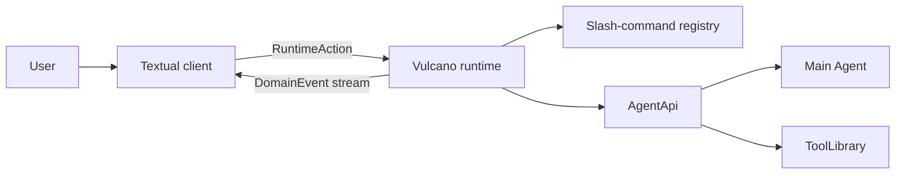

# Vulcano

## Overview

Vulcano is msgflux's terminal client for code-agent runtimes. The CLI currently
starts with a deterministic mock responder, while the runtime can already bind
the main msgflux Agent through a stable high-level facade.

The terminal is intentionally a thin client:



The runtime owns slash commands, execution state, and events. Textual only sends
actions and projects events. This boundary allows a future browser, classic
terminal, or remote client to use the same runtime without duplicating command
logic.

!!! warning "Preview CLI"
    The `vulcano` entry point still creates `MockResponder`. Application code
    can construct `VulcanoRuntime(agent=agent)` now; the CLI wiring will switch
    after the native Agent event stream is merged.

## Installation

Vulcano is included in the msgflux distribution. Its terminal dependencies are
an optional extra so importing msgflux does not load Textual or Rich:

```bash
pip install "msgflux[vulcano]"
```

Start the client with:

```bash
vulcano
```

Use `--mock-delay 0` to disable the delay between mock stream chunks.

## Runtime-owned commands

Every prompt becomes a `SubmitInput` action. Inputs beginning with `/` are
parsed and executed by `CommandRegistry` inside the runtime. The client does not
keep a second command table.

The preview registers these commands:

| Command | Purpose |
|---------|---------|
| `/help` | List commands known by the runtime. |
| `/echo <text>` | Emit text from the runtime. |
| `/clear` | Request the client to clear its transcript. |
| `/about` | Describe the active runtime. |
| `/extensions` | List loaded extensions and failures. |
| `/reload` | Unload and reload extensions. |
| `/quit` | Stop the runtime and connected clients. |

Commands that affect presentation emit a `client.action` event. The decision
still belongs to the runtime; the Textual client only applies the requested
effect.

## Extensions

An extension is a Python module with a synchronous or asynchronous `setup`
function. The function receives an `ExtensionApi` bound to that extension and
runtime generation.

Create `review.py`:

```python
from msgflux.vulcano import (
    CommandResult,
    EventDraft,
    EventType,
)

EXTENSION_NAME = "review"
EXTENSION_API_VERSION = 1


async def setup(api):
    @api.command(
        "review",
        "Review a path in the working tree.",
        usage="/review <path>",
    )
    async def review(args, ctx):
        path = args
        return CommandResult(
            events=(
                EventDraft(
                    EventType.COMMAND_OUTPUT,
                    {"text": f"Review queued for `{path}`"},
                ),
            )
        )
```

Load it explicitly:

```bash
vulcano --extension ./review.py
```

The repository also contains a runnable example:

```bash
vulcano -e examples/vulcano_extension.py
# Then enter: /hello Ada
```

`-e` is the short form and may be repeated. The path can point to a `.py` file,
a Python package containing `__init__.py`, or a directory containing multiple
extensions.

The handler and `setup` may be synchronous or asynchronous. Names and aliases
are unique; collisions fail during registration. Everything registered through
`ExtensionApi` belongs to that extension generation and is removed on reload.
If `setup` fails, partial registrations are rolled back.

### Command API

Every slash-command handler receives `CommandContext.api`. Core commands get a
core `ExtensionApi`; extension commands get the API owned by their extension:

```python
@api.command("where", "Show the extension source.")
def where(args, ctx):
    source = ctx.api.source
    generation = ctx.api.generation
    extension_control = ctx.api.services["extensions"]
```

The canonical API follows Pi's registration shape:

```python
from msgflux.vulcano import CommandOptions

api.register_command(
    "where",
    CommandOptions(
        description="Show the extension source.",
        handler=where,
    ),
)
```

Handlers receive `(args, ctx)`, as in Pi. `args` is the raw string after the
slash-command name. `ctx` carries the extension-owned `ExtensionApi`, the
correlation id, the event emitter, and the runtime command view.
`api.command(...)` is Python decorator sugar over `register_command`; internal
commands use the same core `ExtensionApi`. This is the stable customization
boundary, without exposing the private `VulcanoRuntime` object. The raw
`CommandRegistry` only stores, resolves, and invokes commands; its mutation
methods are internal.

### Main Agent and tools

`ExtensionApi.agent` is an owner-aware facade over the main Agent.
`ExtensionApi.tools` is a convenience alias for `api.agent.tools`. The facade
operates on `Agent.tool_library`; it does not copy tools into a Vulcano registry:

```python
def setup(api):
    @api.tool
    def inspect_diff(path: str) -> str:
        """Inspect the diff for one path."""
        return read_diff(path)
```

`api.register_tool(callable)` and `api.agent.tools.register(callable)` return a
`ToolRegistration` handle. Registrations belong to the extension generation and
are removed on setup rollback, reload, or shutdown. The facade also exposes the
current tool names and, with the runtime-stack release, tool execution through
`await api.tools.execute(name, arguments)`.

Bind an Agent before `runtime.start()` so extensions can register tools during
setup:

```python
runtime = VulcanoRuntime(agent=agent)
# Equivalent before start: runtime.bind_agent(agent)
```

The facade intentionally exposes high-level operations instead of the raw Agent
object:

- `api.agent.run(...)` executes a private/custom Agent call without projecting
  it to clients.
- `api.agent.stream_events(...)` yields normalized `EventDraft` instances.
- `api.agent.respond(..., emit=...)` forwards that stream and returns its final
  status and content.
- `api.agent.tools` registers, lists, and executes tools through the real
  `ToolLibrary`.

### Agent-driven slash commands

Commands can run a custom flow over the main Agent and publish each event while
the flow is active. This is the foundation for commands such as `/goal`:

```python
@api.command("goal", "Plan and execute a goal.", usage="/goal <objective>")
async def goal(args, ctx):
    # `/goal fix the parser` produces args == "fix the parser".
    objective = args

    # A command may perform hidden preparation with api.agent.run(...) first.
    result = await ctx.api.agent.respond(
        f"Plan and execute this objective: {objective}",
        emit=ctx.emit,
        vars={"flow": "goal"},
    )

    return CommandResult(
        events=(
            EventDraft(
                EventType.COMMAND_OUTPUT,
                {"text": f"Goal flow finished with `{result.status}`."},
            ),
        )
    )
```

`context.emit()` publishes immediately with the command correlation id. Events
returned in `CommandResult` are published after the handler returns. The TUI
does not know how `/goal` works; it only projects the runtime event stream.

### Observing runtime events

Observers are passive and fail open. An observer error produces an
`extension.failed` event without interrupting the Agent or mock stream:

```python
async def record_completion(event, context):
    print(event.correlation_id, event.payload.get("status"))

api.on(EventType.ASSISTANT_COMPLETED, record_completion)
```

Use `"*"` to observe every domain event. `api.observe(...)` is the decorator
convenience over `api.on(...)`.

### Cleanup and reload

Register cleanup for resources owned by the current generation:

```python
@api.on_cleanup
async def close_client():
    await client.aclose()
```

`/reload` invalidates the old `ExtensionApi`, removes its commands and
observers, runs cleanup in reverse registration order, and imports a fresh
module generation. Calling a stale API raises an error instead of mutating the
new runtime.

### Discovery and trust

Sources load in this stable order:

| Source | Location | Trust rule |
|--------|----------|------------|
| Installed | `msgflux.vulcano.extensions` entry points | Authorized when installed. |
| User | `~/.vulcano/extensions` | Automatically loaded. |
| Project | `.vulcano/extensions` | Requires `--trust-project-extensions`. |
| CLI | `--extension PATH` | The explicit flag grants trust. |

Disable every source with `--no-extensions`.

Project extensions are Python code with the same permissions as Vulcano. The
runtime discovers them only after explicit trust; merely entering a repository
does not import its Python files.

### Distributing an installed extension

External wheels expose a setup function through the standard entry-point group:

```toml
[project.entry-points."msgflux.vulcano.extensions"]
review = "my_package.vulcano:setup"
```

The loaded callable receives `ExtensionApi`. Installed name collisions and
unsupported `EXTENSION_API_VERSION` values become extension diagnostics rather
than silently overriding another extension.

The current API exposes commands, main-Agent execution, ToolLibrary
registration, observers, cleanup, source, generation, and capability services.
Shortcuts, flags, custom renderers, and session state remain later parity layers
with Pi.

## Event contract

`DomainEvent` carries a stable event name, monotonic sequence, JSON-compatible
payload, correlation id, and UTC timestamp. Each subscriber receives its own
queue, so telemetry, persistence, and a TUI can observe the same stream without
consuming events from one another.

Extensions add `extension.loaded`, `extension.unloaded`, and
`extension.failed` lifecycle events. Extension observers run after a domain
event is published and cannot transform or block it. Control hooks will use the
existing msgflux hook system when the Agent adapter lands; they should remain a
separate API from passive observation.

The mock response follows the same lifecycle expected from the Agent adapter:

1. `message.user`
2. `assistant.started`
3. zero or more `assistant.delta`
4. `assistant.completed`

`MsgfluxAgentAdapter` currently synthesizes this lifecycle from `Agent.acall()`
and `ModelStreamResponse`. `ExtensionApi.agent.stream_events()` is already the
stable entry point. After native `Agent.stream_events()` is merged, only the
adapter translates its native events; extensions and clients keep the same
contract. Hooks remain runtime instrumentation points and publish domain events
instead of calling UI widgets.

## Terminal stack

Textual owns terminal input, layout, workers, and the event loop. Rich renders
Markdown and styled transcript content. Prompt Toolkit is deliberately not used
inside the Textual application because both frameworks manage raw terminal
input. A future classic CLI may use Prompt Toolkit as a separate client over the
same runtime contract.
